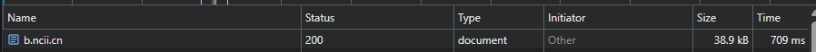
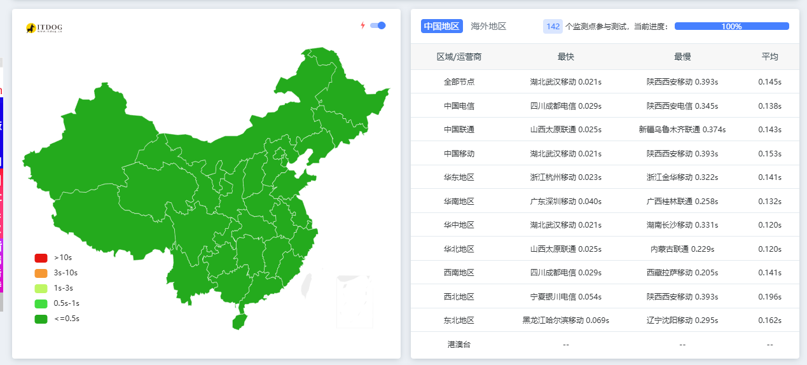
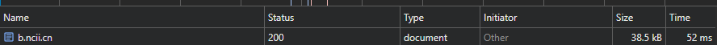

# Halo CDN 缓存刷新插件

一个用于 Halo 2.x 的 CDN 缓存自动刷新插件。当文章/页面发布、更新或评论审核通过时，自动刷新对应页面的 CDN 缓存。支持 阿里云、腾讯云、Cloudflare。

可开启全站缓存，配合本插件使用，提升站点缓存灵活性，平衡缓存命中率与内容实时性。

## 功能特性
> 评论指的是官方评论组件，第三方评论如 Twikoo 为 JS 嵌入，无需额外支持。
- 🚀 文章发布/更新时自动刷新 CDN 缓存
- 📄 独立页面发布/更新时自动刷新
- 💬 评论审核通过后自动刷新对应页面
- 🔧 支持手动刷新指定 URL
- 📝 刷新日志记录与查看
- ⏱️ URL 防抖（5秒内相同 URL 只刷新一次）

## 支持的 CDN 提供商

| 提供商 | 类型 | 状态 |
|--------|------|------|
| 阿里云 CDN | 传统 CDN | ✅ 支持 |
| 阿里云 ESA | 边缘安全加速 | ✅ 支持 |
| 腾讯云 CDN | 传统 CDN | ✅ 支持 |
| 腾讯云 EdgeOne | 边缘安全加速 | ✅ 支持 |
| Cloudflare | - | ✅ 支持 |

## 安装

1. 下载最新版本的 JAR 文件
2. 在 Halo 后台 -> 插件 -> 安装插件 -> 本地上传
3. 启用插件

## 配置说明

进入插件设置页面进行配置。

### 基本设置

| 配置项 | 说明 |
|--------|------|
| 启用 CDN 缓存刷新 | 总开关 |
| CDN 提供商 | 选择你使用的 CDN 服务 |
| Access Key ID | 阿里云/腾讯云的 AccessKey ID |
| Access Key Secret | 阿里云/腾讯云的 AccessKey Secret |
| Cloudflare API Token | Cloudflare Token |
| Zone ID / Site ID | 阿里云 ESA 填 Site ID，腾讯云 EdgeOne/Cloudflare 填 Zone ID |
| 站点域名 | 你的站点域名，如 `https://example.com` |

### 各提供商配置
**API 需要给 CDN 刷新权限**

#### 阿里云 CDN

- Access Key ID: 阿里云 AccessKey ID
- Access Key Secret: 阿里云 AccessKey Secret

#### 阿里云 ESA（边缘安全加速）

- Access Key ID: 阿里云 AccessKey ID
- Access Key Secret: 阿里云 AccessKey Secret
- Zone ID / Site ID: ESA 站点 ID（在 ESA 控制台查看）

#### 腾讯云 CDN

- Access Key ID: 腾讯云 SecretId
- Access Key Secret: 腾讯云 SecretKey

#### 腾讯云 EdgeOne

- Access Key ID: 腾讯云 SecretId
- Access Key Secret: 腾讯云 SecretKey
- Zone ID / Site ID: EdgeOne 站点 ID

#### Cloudflare

- Cloudflare API Token: API Token（需要 `Zone.Cache Purge` 权限）
- Zone ID / Site ID: Zone ID（在 Cloudflare 控制台域名概览页右侧查看）

创建 Cloudflare API Token：
1. 登录 Cloudflare Dashboard
2. My Profile -> API Tokens -> Create Token
3. 使用 "Purge Cache" 模板或自定义权限
4. Zone Resources 选择对应域名

### 刷新选项

| 配置项 | 说明 | 默认值 |
|--------|------|--------|
| 刷新首页 | 文章发布时刷新首页 | 开启 |
| 刷新归档页 | 文章发布时刷新归档页 | 开启 |
| 刷新分类页 | 文章发布时刷新分类页 | 开启 |
| 刷新标签页 | 文章发布时刷新标签页 | 开启 |
| 评论后刷新 | 评论审核通过后刷新页面 | 开启 |
| 自定义刷新路径 | 额外刷新的路径，逗号分隔 | - |

### 路由设置

如果你修改了 Halo 的默认路由，需要在这里同步配置：

| 配置项 | 默认值 |
|--------|--------|
| 归档页路由 | archives |
| 分类页路由 | categories |
| 标签页路由 | tags |

## 刷新日志

在插件设置页面的「刷新日志」标签页可以：

- 查看刷新历史记录
- 手动刷新指定 URL
- 清空日志

## 触发时机

| 事件 | 刷新内容 |
|------|----------|
| 文章发布 | 文章页、首页、归档页、分类页、标签页、自定义路径 |
| 文章更新 | 文章页、首页、归档页、分类页、标签页、自定义路径 |
| 页面发布/更新 | 页面 URL、首页、自定义路径 |
| 评论审核通过 | 对应文章/页面 URL |

## 注意事项

1. 确保 Halo 后台的「站点地址」配置正确，插件会使用该地址构建刷新 URL
2. CDN 刷新有频率限制，请勿频繁操作，具体请参考各 CDN 提供商文档
3. 同一 URL 在 5 秒内只会刷新一次（防抖）

## 效果截图
> 全站都使用 CDN 进行缓存了，除了 /console/\*, /api/\* 这些路由。
### 插件开启前


### 插件开启后



## 开发

```bash
# 构建
./gradlew build

# 跳过测试构建
./gradlew build -x test
```

## 许可证

[GPL-3.0](LICENSE)

## 作者

[SwaggyMacro](https://github.com/SwaggyMacro)
